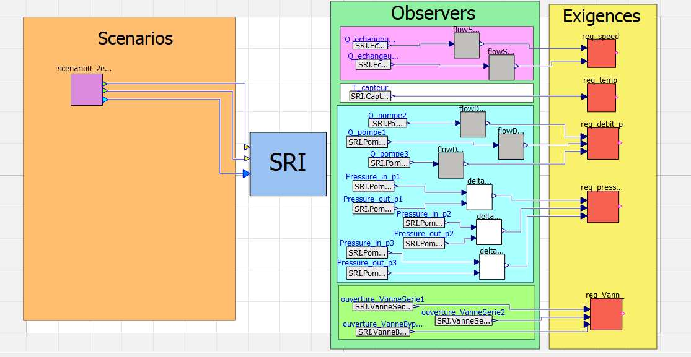

## Description
Ce projet vise à modéliser l'architecture du système SRI, à simuler son comportement thermique et hydraulique, et à vérifier formellement les exigences industrielles à l'aide de la bibliothèque **CRML**.

## Structure du Projet

Le projet est organisé dans le dossier `SRI/cooling_system/` :

* **`ThermoSysPro/`** : Bibliothèque de composants physiques (standard EDF) utilisée comme base pour modéliser les échangeurs, vannes et pompes.
* **`Behavior/`** : Modélisation comportementale et logique de commande.
    * `SRIN4_v4` : Modèle global incluant la régulation de niveau et commande des vannes.
* **`Verification/`** : Ingénierie des exigences.
    * `Observers/` : Blocs de surveillance (Vitesse, Delta Pression, Température).
    * `Requirements/` : Formalisation des exigences (CRML).
    * `Scenarios/` : Cas de tests (Nominal, Dégradé).

## Exigences

1.  **Régulation Thermique :** Maintien de la température à **17°C** (±0.5°C) via vannes séries et bypass.
2.  **Gestion Hydraulique :**
    * Maintien du débit total à **3200 m³/h**.
    * Protection cavitation (Débit min > 700 m³/h).
    * Limitation de vitesse échangeurs (< 6 m/s).
3.  **Redondance :** Gestion des 3 pompes (2 actives + 1 secours).

## Scénarios Simulés

* **Scénario 0_2 (Nominal)** :
    * 2 échangeurs actifs.
    * Résultat : Température stable à 17°C, temps de réponse ~200s.
* **Scénario 0_1 (Maintenance)** :
    * 1 échangeur actif.
    * Résultat : Stabilisation à ~22.3°C (conforme à la limite < 30°C).

## Utilisation

1.  Ouvrir **OpenModelica**.
2.  Charger les packages `SRI/BFE/package.mo`, `SRI/cooling_system/package.mo` et `SRI/ThermoSysPro/package.mo`.
3.  Exécuter les modèles situés dans `cooling_system/Verification/`.
